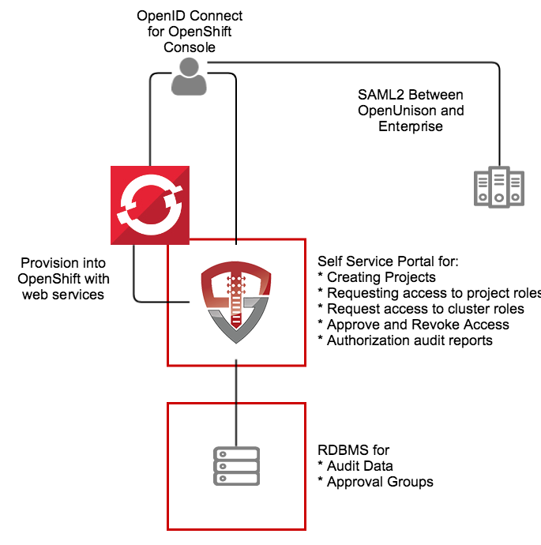

# OpenShift Self Service Portal

This application, built on OpenUnison, is a self service portal for Red Hat's OpenShift and OKD.  It provides a single interface for:

1. Authentication via SAML2, multiple LDAP directories, add compliance acknowledgment, etc
2. Self service portal for requesting access to and getting approval for individual projects
3. Self service requests for gaining cluster level roles
4. Support removing users' access
5. Reporting

The portal runs inside of OpenShift, leveraging OpenShift for scalability and secret management.  



The OpenUnison deployment stores all OpenShift access information as a group in OpenShift, as opposed to a group in an external directory.  The only groups stored outside of OpenShift are approval groups which are stored in the relational database.

# Roles Supported

## Cluster

1.  Administration - Full cluster management access

## Projects

1.  Admin - Can edit and deploy into a project, can not change project annotations
2.  View - Can view contents of a project, but can not make changes

## Non-OpenShift

1.  System Approver - Able to approve access to roles specific to OpenUnison
2.  Auditor - Able to view audit reports, but not request projects or approve access

# Deployment

The deployment model assumes:
1. OpenShift 3.x or higher (OKD is supported)
2. MySQL or MariaDB
3. The metadata for your SAML2 identity provider
4. Email Server for notifications

*NOTE* if using the Red Hat certified images, you'll need credentials for Red Hat Connect.

These instructions cover using the Source-to-Image created by Tremolo Security for OpenUnison.  The Source-to-Image builder will build a container image from your unison.xml and myvd.props file that has all of your libraries running a hardened version of Undertow on the latest CentOS or Red Hat Enterprise Linux.  The keystore required for deployment will be stored as a secret in OpenShift.


## Create Environments File

OpenUnison stores environment specific information, such as host names, passwords, etc, in a properties file that will then be loaded by OpenUnison and merged with its configruation.  This file will be stored in Kubernetes as a secret then accessed by OpenUnison on startup to fill in the `#[]` parameters in `unison.xml` and `myvd.conf`.  For instance the parameter `#[OU_HOST]` in `unison.xml` would have an entry in this file.  Below is an example file:

```properties
BUILDER_IMAGE=tremolosecurity/openunisons2idocker
OPENSHIFT_CONSOLE_URL=https://openshift.tslocal.lan:8443/console
OU_CERT_C=US
OU_CERT_L=Alexandria
OU_CERT_O=Tremolo Security
OU_CERT_ST=Virginia
OU_HIBERNATE_DIALECT=org.hibernate.dialect.MySQL5InnoDBDialect
OU_HOST=openunison.apps.tslocal.lan
OU_JDBC_DRIVER=com.mysql.jdbc.Driver
OU_JDBC_PASSWORD=start123
OU_JDBC_URL=jdbc:mysql://192.168.56.101:3306/unison
OU_JDBC_USER=unison
OU_JDBC_VALIDATION=SELECT 1
OU_OIDC_OPENSHIFT_REIDRECT=https://openshift.tslocal.lan:8443/oauth2callback/openunison
OU_OIDC_OPENSHIFT_SECRET=start123
OU_QUARTZ_DIALECT=org.quartz.impl.jdbcjobstore.StdJDBCDelegate
OU_QUARTZ_MASK=10
REG_CRED_PASSWORD=XXXXX
REG_CRED_USER=XXXXX
SESSION_INACTIVITY_TIMEOUT_SECONDS=900
SMTP_FROM=donotreply@tremolosecurity.com
SMTP_HOST=smtp.gmail.com
SMTP_PASSWORD=XXXXXXXX
SMTP_PORT=587
SMTP_TLS=true
SMTP_USER=donotreply@tremolosecurity.com
unisonKeystorePassword=start123
```

*Detailed Description or Properties*

| Property | Description |
| -------- | ----------- |
| OU_HOST  | The host name for OpenUnison.  This is what user's will put into their browser to login to Kubernetes |
| OU_HIBERNATE_DIALECT | Hibernate dialect for accessing the database.  Unless customizing for a different database do not change |
| OU_QUARTZ_DIALECT | Dialect used by the Quartz Scheduler.  Unless customizing for a different database do not change  |
| OU_JDBC_DRIVER | JDBC driver for accessing the database.  Unless customizing for a different database do not change |
| OU_JDBC_URL | The URL for accessing the database |
| OU_JDBC_USER | The user for accessing the database |
| OU_JDBC_PASSWORD | The password for accessing the database |
| OU_JDBC_VALIDATION | A query for validating database connections/ Unless customizing for a different database do not change |
| SMTP_HOST | Host for an email server to send notifications |
| SMTP_PORT | Port for an email server to send notifications |
| SMTP_USER | Username for accessing the SMTP server (may be blank) |
| SMTP_PASSWORD | Password for accessing the SMTP server (may be blank) |
| SMTP_FROM | The email address that messages from OpenUnison are addressed from |
| SMTP_TLS | true or false, depending if SMTP should use start tls |
| OU_CERT_OU | The `OU` attribute for the forward facing certificate |
| OU_CERT_O | The `O` attribute for the forward facing certificate |
| OU_CERT_L | The `L` attribute for the forward facing certificate |
| OU_CERT_ST | The `ST` attribute for the forward facing certificate |
| OU_CERT_C | The `C` attribute for the forward facing certificate |
| unisonKeystorePassword | The password for OpenUnison's keystore |
| SESSION_INACTIVITY_TIMEOUT_SECONDS | The number of seconds of inactivity before the session is terminated, also the length of the refresh token's session |
| BUILDER_IMAGE | The name of the image used to build OpenUnison.  This image can be eiter the CentOS 7 based image on dockerhub, or an image from a privare respository.  If wanting to use the Red Hat certified image, use `registry.connect.redhat.com/tremolosecurity/openunison-s2i-10` |
| OPENSHIFT_CONSOLE_URL | The URL for the OpenShift cluster's console.  Usually `https://host.domain/console/` |
| OU_OIDC_OPENSHIFT_REIDRECT | Redirect back to OpenShift to finish the signin process, usually the same host as the console with the path `/oauth2callback/openunison` |
| OU_OIDC_OPENSHIFT_SECRET | A shared secret between OpenShift and OpenUnison to complete authentication |
| REG_CRED_USER | Username for a private registry (such as registry.connect.redhat.com) |
| REG_CRED_PASSWORD | Password for a private registry (such as registryion.connect.redhat.com) |

Store these parameters in a file called `input.props`.

## Prepare Deployment

Perform these steps from a location with a working `kubectl` configuration:

1. Create a directory for secrets to store `input.props`, ie `/path/to/secrets` and put `input.props` in that directory
2. Create a directory for configmaps, ie `/path/to/configmaps`, and copy the metadata from your SAML2 identity provider to `/path/to/configmaps/saml2-metadata.xml`


## Deployment

Based on where you put the files from `Prepare Deployment`, run the following:

```
curl https://raw.githubusercontent.com/TremoloSecurity/kubernetes-artifact-deployment/master/src/main/bash/deploy_openunison.sh | bash -s /path/to/configmaps /path/to/secrets https://raw.githubusercontent.com/OpenUnison/openunison-openshift-saml2/master/src/main/yaml/artifact-deployment.yaml
```

The output will look like:

```
namespace/openunison-deploy created
configmap/extracerts created
secret/input created
clusterrolebinding.rbac.authorization.k8s.io/artifact-deployment created
job.batch/artifact-deployment created
NAME                        READY     STATUS    RESTARTS   AGE
artifact-deployment-jzmnr   0/1       Pending   0          0s
artifact-deployment-jzmnr   0/1       Pending   0         0s
artifact-deployment-jzmnr   0/1       ContainerCreating   0         0s
artifact-deployment-jzmnr   1/1       Running   0         4s
artifact-deployment-jzmnr   0/1       Completed   0         15s
```

Once you see `Completed`, you can exit the script (`Ctl+C`).  This script creates all of the appropriate objects in Kubernetes, signs certificates and deploys both OpenUnison and the Dashboard.  

## Complete Integrate with your Identity Provider

Run `kubectl describe configmap api-server-config -n openunison` to get the metadata for your identity provider.  Import it into your identity provider and add the following attributes to the assertion so OpenUnison knows how the logged in uers is:

| Attribute Name | Active Directory Attribute | Description |
| -------------- | -------------------------- | ----------- |
| uid            | samAccountName             | User's login id |
| givenName      | givenName                  | User's first name |
| sn             | sn                         | User's last name |
| mail           | mail                       | User's email address |

If using Active Directory Federation Services, you can use the following claims transformation rule:
```
c:[Type == "http://schemas.microsoft.com/ws/2008/06/identity/claims/windowsaccountname", Issuer == "AD AUTHORITY"]
 => issue(store = "Active Directory", types = ("http://schemas.xmlsoap.org/ws/2005/05/identity/claims/nameidentifier", "uid", "givenName", "sn", "mail"), query = ";sAMAccountName,sAMAccountName,givenName,sn,mail;{0}", param = c.Value);
```

Once the metadata is imported and the attributes are added, you are ready to login to OpenUnison.


## Building OpenUnison

Once deployed, OpenShift will start building OpenUnison.  You can check the build process (depending on your internet connection) by running  `oc get builds`.  Once OpenUnison is running, you can proceed to the `First Login to OpenShift Identity Manager`

## First Login to the OpenShift Identity Manager

At this point you should be able to login to OpenUnison using the host specified in  the `HOSTNAME_HTTPS` of the template.  Once you are logged in, logout.  Users are created in the database "just-in-time", meaning that once you login the data representing your user is created inside of the database we are pointing to in our `ou.env` file.

## Create First Administrator

The user you logged in as is currently unprivileged.  In order for other users to login and begin requesting access to projects this first user must be enabled as an approver.  Login to the MySQL database that is configured in `ou.env` and execute the following SQL:

```sql
insert into userGroups (userId,groupId) values (2,1);
```

This will add the administrator group to your user.  Logout of OpenUnison and log back in.

## Self Request & Approve Cluster Administrator

Once SSO is enabled in the next step, you'll need a cluster administrator to be able to perform cluster level operations:

1.  Login to OpenUnison
2.  Click on "Request Access" in the title bar
3.  Click on "OpenShift Administration"
4.  Click "Add To Cart" next to "Cluster Administrator"
5.  Next to "Check Out" in the title bar you'll see a red `1`, click on "Check Out"
6.  For "Supply Reason", give a reason like "Initial user" and click "Submit Request"
7.  Since you are the only approver refresh OpenUnison, you will see a red `1` next to "Open Approvals".  Click on "Open Approvals"
8.  Click "Review" next to your email address
9.  Specify "Initial user" for the "Justification" and click "Approve"
10. Click on "Confirm Approval"

At this point you will be provisioned to the `cluster-admins` group in OpenShift we created earlier.  Logout of OpenUnison and log back in.  If you click on your email address in the upper left, you'll see that you have the Role `OpenShift - cluster-admins`.  

## Enable SSO with OpenShift Console
Next update the `projectRequestMessage` parameter in `master-config.yaml` with a message to users telling them how to request projects such as **To request a new project click on the New OpenShift Project badge in OpenUnison**.

Finally, configure SSO per the instructions in the `api-server-config` configmap in the `openunison` project.  *NOTE:* make sure to set the `clientSecret` attribute for your cluster.

# Whats next?
Now you can begin mapping OpenUnison's capabilities to your business and compliance needs.  For instance you can add multi-factor authentication with TOTP or U2F, Create privileged workflows for onboarding, scheduled workflows that will deprovision users, etc.
